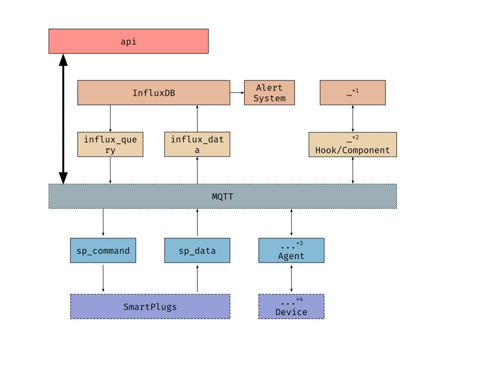

.. IoToad docs documentation master file, created by
   sphinx-quickstart on Mon Feb  3 11:47:09 2020.
   You can adapt this file completely to your liking, but it should at least
   contain the root `toctree` directive.

Welcome to IoToad docs's documentation!
=======================================

Why: the context
=================
We were asked to monitor Deustotech's power consumption.
We needed to gather the energy usage of each workplace,
as well as conference rooms and printers power waste.

These were all the requirements:

- Monitoring of work place sockets, meeting rooms and printers (meeting rooms and offices we treat them the same).

- Data storage in Influx.

- Specification of the monitored devices, using well-defined identifiers and their locations in Deustotech.

- System and code documentation in Read The Docs.

- RESTful API implementation and specification for data queries.

- RESTful API implementation and specification for device control (turn off, on).

- Specification and documentation of Hooks [#]_ to facilitate integration with different devices and middlewares.

- Implementation of error alerts.

- Backup mechanism implementation.

.. [#] Hook: techniques used to alter or increase the behavior of
  an operating system, applications or other software components
  by intercepting function calls or messages or events passed
  between software components

What: the solution
===================
As a result we created an IoT system where each workplace,
conference room and printer is plugged to an SmartPlug_.

.. _SmartPlug: https://www.tp-link.com/en/home-networking/smart-plug/hs110/

The gathered data is stored in a time series database (influxDB).

Also a RESTful API is exposed through which the data can be retrieved, and
SmartPlugs are controlled (turned ON/OFF).

How: the system's design
==========================
The system architecture can is shown in the following diagram:

* **API**: Abstracts data queries and control requests into a
  REST API web server. The API specifications are presented in
  `API specification`_. Behind the scenes it is simple its implementation:
  it receives a REST request, it formats the message, and
  it publishes to MQTT, where a *Component* executes the query.
  Finally, it waits for the *Component* response, which is published
  in another MQTT topic.

* **Component**: It is the application that subscribes to a specific
  MQTT topic, where receives data queries. It responsible of
  executing the queries; usually this means to look up in a
  Database. Once the query is executed, it publishes the
  result to a MQTT topic where the *API* is listening.

* **Hook**: It is responsible of reading from an MQTT topic
  the data generated by the devices and taking care of it.
  For example, in case of the SmartPlugs, it stores them into
  InfluxDB database.

* **Agent**: It is the middleware that deals with the devices
  directly. Agents can be classified into two groups: controllers
  and collectors. The controllers send commands to the devices,
  such as "turn ON/OFF". And the collectors are responsible of
  retrieving the data from the devices. Both of them use MQTT
  as the communication techonolgy with other components or
  applications.

.. _`API specification`:
Usage: REST APIs
=================
Main API:

.. raw:: html
   :file: _static/html/api-main.html
Influx API: :doc:`api-influx`
sp_controller API: :doc:`api-sp_controller`

Extensibility: how to add new devices/APIs
============================================

Code
====
[Modules code]
