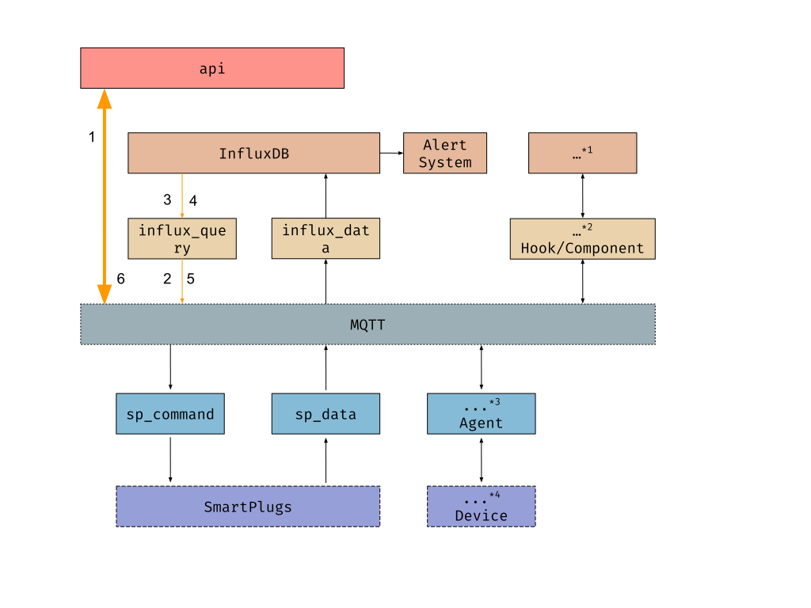

========
Modules
========

The modules of the system are the ones that appear in the following diagram:

.. image:: _static/imgs/system-architecture.svg

MQTT
-----
This is not a module, but a publish/subscribe message broker technology. Nevertheless it is important to know
what is the design behind all the communications through this technology; how the topics
are organized and constructed, and how the messages are formatted.

:doc:`More details <modules/mqtt>`
~~~~~~~~~~~~~~~~~~~~~~~~~~~~~~~~~~

api
----
This module is a REST HTTP gateway for communicating with the IoToad system.
Whenever you want to :code:`query` data or send a :code:`command`, you do it through this module.
It is a dumb module that its only logic is:

#. Listen for HTTP REST requests
#. Parse the request, and send it to MQTT so that other module
   (such as :code:`influx_query` or :code:`sp_command`) handles the query/command
#. Wait for the reply listening on a MQTT
#. Send back the reply to the HTTP request sender

.. image:: _static/imgs/flow-api.svg

:doc:`More details <modules/api>`
~~~~~~~~~~~~~~~~~~~~~~~~~~~~~~~~~~

influx_query
------------
This module is responsible for querying InfluxDB and returning the response.
:code:`influx_query` subscribes to :code:`query/influx_query/#` MQTT topic,
so that the topics are :code:`query/influx_query/<database>/<measurement>`.

The message recieved follows the format specified in :doc:`MQTT <modules/mqtt>`,
where the query arguments are inside the :code:`data` field. The message also conatains
the :code:`response_topic` field that is used for later publishing the response to.

For example:

:code:`query/influx_query/sp/power`

.. code-block:: json

   {
        "response_topic": "responses/api/809bd939baa44f1f87fdd1099ea05a62",
        "data": {
            "operation": "sum",
            "type": "w",
            "from": 1585217932.2041745
        }
   }

Then, :code:`influx_query` performs InfluxDB query, formats the result following SenML specifications,
and it publishes the result back to the :code:`response_topic` topic. The SenML response is
inside the :code:`data` field, or if there has been any error, the :code:`error` field will be filled.

Following the example above:

:code:`responses/api/809bd939baa44f1f87fdd1099ea05a62`

.. code-block:: json

   {
        "data": [
          {"n":"sum","v":1.2},
        ]
   }

sp_command
-----------
This module is responsible for switching smartplugs on and off. Smartplugs can be
identified by their IDs, rows or columns. The smartplugs are specified in the MQTT topic.
For example, :code:`sp_command/row/1` will affect all smartplugs in row 1,
:code:`sp_command/column/2` will affect smartplugs in column 2 and :code:`sp_command/sp_w.r1.c2`
will affect the smartplug with ID :code:`sp_w.r1.c2`. The content of the request should
have a :code:`payload` field with a JSON with one field: :code:`data`. It can have a value
of either 1 (switch on) or 0 (switch off). An example of a topic and data:

:code:`sp_command/row/1`.

.. code-block:: json

  {
    "payload": {
      "status": 1
    }
  }

If multiple smartplugs, rows or columns are to be switched on or off,
the :code:`subtopics` data field should be used. Each of the elements of
:code:`subtopics` will be appended separately to the topic, forming multiple
complete topics. For example, in the example above four topics would be specified.
The first one would be :code:`sp_command/row/1` and the last one
:code:`sp_command/sp_w.r4.c5`.

A valid topic and data for multiple targets:

:code:`sp_command/`.

.. code-block:: json

  {
    "subtopics": {
      "row/1",
      "row/2",
      "column/1",
      "sp_w.r4.c5"
    },
    "payload": {
      "status": 0
    }
  }

If a response topic is specified, a list of sucessful and unsuccessful smartplugs
and the reason they could not be switched on or off will be returned. For example:

.. code-block:: json

  {
    "sp_command/row/0": {
      "data": {
        "successful": [
          "192.168.1.51"
        ]
      },
      "error": {
        "192.168.1.51": "timeout"
      }
    }
  }

sp_data
--------
This module is responsible for collecting power measurements from smartplugs and
sending it to MQTT. Data will be published to the MQTT topic :code:`data/sp_data/<database>`.
The value of :code:`database` is specified in the configuration file. If multiple databases
are specified, data will be published to multiple topics: one for each database. An example
might be :code:`influx_data/sp`: the :code:`sp` database of the :code:`influx_data` module.

Example of topic and data:

:code:`data/sp_data/influx_data/sp`

.. code-block:: json

  {
    "data": [
      {
        "bn": "sp_w.r0.c0/power",
        "bu": "W",
        "t": 1593599018.0395682,
        "v": 0
      }
    ]
  }

The IP addresses of each smartplug are unknown, thus the module sends request to a
known range of IP addresses and matches the MAC addresses of the responding devices
to the known MAC addresses of smartplugs to identify them. There is one routine for
each smartplug. The range of IP addresses is defined in the :code:`[WORKSPACE]`
section of the configuration file. ETCD is used to store smartplug IDs, map addresses
and their last known IP address. There are three ETCD directories:
:code:`/smartplugs/mac_to_id` to map MAC addresses to smartplug IDs,
:code:`/smartplugs/id_to_userid` to map smartplig IDs to user IDs and
:code:`/smartplugs/ip_cache` to store last known IP addresses.

influx_data
------------
This module is responsible for storing data to InfluxDB. Other modules
publish the data into :code:`data/<source-id>/influx_data/<influx-database>`.
And :code:`influx_data` reads and stores it.

#. Listen for MQTT messages in topics that match: :code:`data/+/influx_data/#`
#. Transform message into Influx data points
#. Store data points to InfluxDB

If a module wants to store data into InfluxDB, it should make use of :code:`influx_data`.
For it, there are some conditions that must be fulfilled:

- The data must be published through MQTT to topics that match: :code:`data/+/influx_data/#`
- The MQTT messages must be formatted as defined in :doc:`MQTT <modules/mqtt>`
- The data to be stored in InfluxDB must be within the :code:`data` field
- and comply with the SenML format where BaseName+Name must be :code:`<id>/<measurement>`,
  e.g. :code:`sp_w.r1.c1/power`
