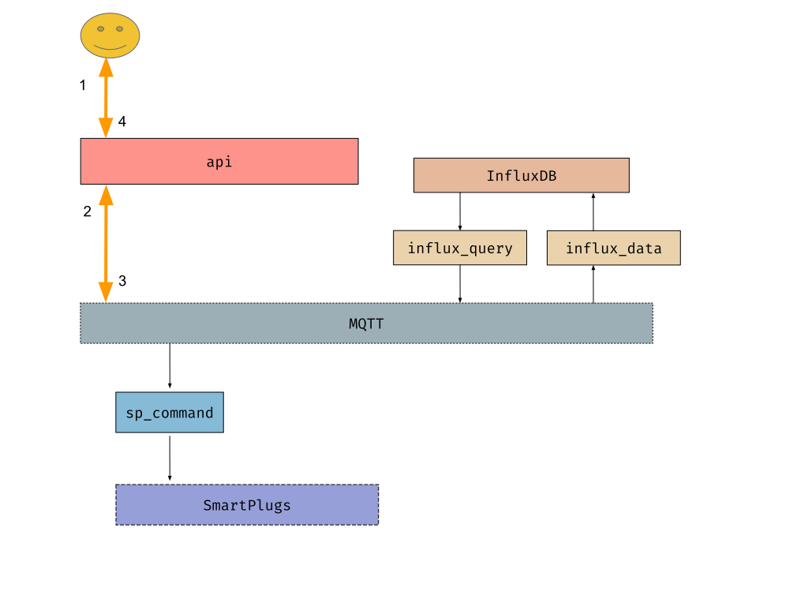

========
Modules
========

The modules of the system are the ones that appear in the following diagram:

.. image:: _static/imgs/system-architecture.svg

MQTT
-----
This is not a module, but a publish/subscribe message broker technology. Nevertheless it is important to know
what is the design behind all the communications through this technology; how the topics
are organized and constructed, and how the messages are formatted.

:doc:`More details <modules/mqtt>`
~~~~~~~~~~~~~~~~~~~~~~~~~~~~~~~~~~

api
----
This module is a REST HTTP gateway for communicating with the IoToad system.
Whenever you want to :code:`query` data or send a :code:`command`, you do it through this module.
It is a dumb module that its only logic is:

#. Listen for HTTP REST requests
#. Parse the request, and send it to MQTT so that other module
   (such as :code:`influx_query` or :code:`sp_command`) handles the query/command
#. Wait for the reply listening on a MQTT
#. Send back the reply to the HTTP request sender

:doc:`More details <modules/api>`
~~~~~~~~~~~~~~~~~~~~~~~~~~~~~~~~~~

influx_query
------------
This module is responsible for querying InfluxDB and returning the response.
:code:`influx_query` subscribes to :code:`query/influx_query/#` MQTT topic,
so that the topics are :code:`query/influx_query/<database>/<measurement>`.

The message recieved follows the format specified in :doc:`MQTT <modules/mqtt>`,
where the query arguments are inside the :code:`data` field. The message also conatains
the :code:`response_topic` field that is used for later publishing the response to.

For example:

:code:`query/influx_query/sp/power`

.. code-block:: json

   {
        "response_topic": "responses/api/809bd939baa44f1f87fdd1099ea05a62",
        "data": {
            "operation": "sum",
            "type": "w",
            "from": 1585217932.2041745
        }
   }

Then, :code:`influx_query` performs InfluxDB query, formats the result following SenML specifications,
and it publishes the result back to the :code:`response_topic` topic. The SenML response is
inside the :code:`data` field, or if there has been any error, the :code:`error` field will be filled.

Following the example above:

:code:`responses/api/809bd939baa44f1f87fdd1099ea05a62`

.. code-block:: json

   {
        "data": [
          {"n":"sum","v":1.2},
        ]
   }

influx_data
------------
This module is responsible for storing data to InfluxDB. Other modules
publish the data into :code:`data/<source-id>/influx_data/<influx-database>`.
And :code:`influx_data` reads and stores it.

#. Listen for MQTT messages in topics that match: :code:`data/+/influx_data/#`
#. Transform message into Influx data points
#. Store data points to InfluxDB

If a module wants to store data into InfluxDB, it should make use of :code:`influx_data`.
For it, there are some conditions that must be fulfilled:

- The data must be published through MQTT to topics that match: :code:`data/+/influx_data/#`
- The MQTT messages must be formatted as defined in :doc:`MQTT <modules/mqtt>`
- The data to be stored in InfluxDB must be within the :code:`data` field
- and comply with the SenML format where BaseName+Name must be :code:`<id>/<measurement>`,
  e.g. :code:`sp_w.r1.c1/power`

